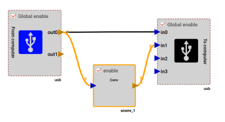
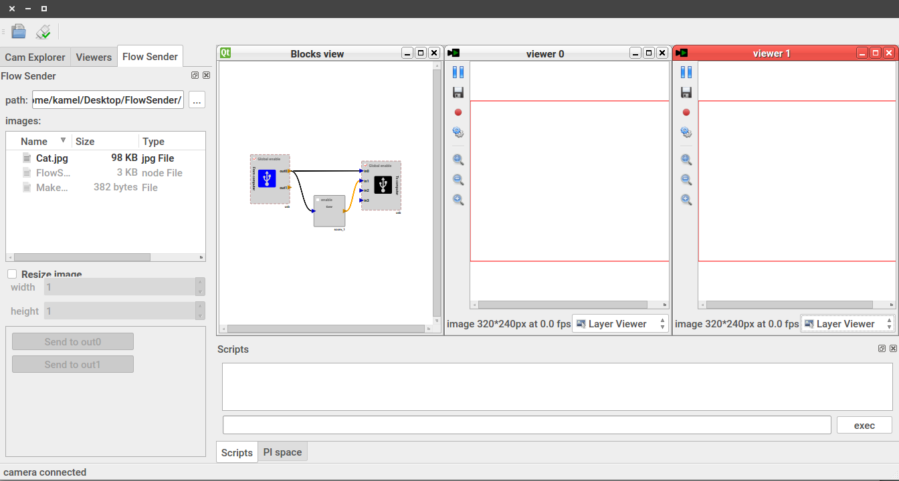
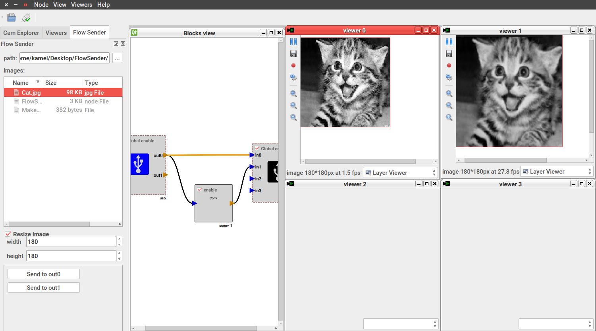

# GPStudio Flow sender 

In this tutorial, we will see how GPSudio can send an image from a host computer to an FPGA,  processes it, then send it back to the PC. This functionality can be very useful when debugging IPs,  and when working with devices with no image sensors.  

1. First, let's create a simple project with the `gpnode_gui` utility. We will use the `dreamcam_c3` board, and consider only the USB IP.

2. In this example, we will send a `cat.jpg` image though USB , perform a 3x3 convolution on it, send it back through USB, and finally display it on GPStudios' viewer. To do so, connect your blocks in the following way:

   

   - The image will be sent though out0
   - The in0 viewer will display the original sent image 
   - The in1 viewer will display the "convolved" image

3. Save, generate, compile and implant you design on the Cyclone III FPGA using the usual commands ...

4. When opening the viewer, you should have something like this:

   

5. Go to the flow sender menu and select the directory where your pictures are stored. Select an image, and resize it to a specific width and hight if needed. In the example, we will use a 180x180 resolution since the image width is a static parameter of the convolution IP.

6. Click on : Send to outX, where X is the flow you connected (out0 in our case), you should expect something like this on the output:

   

Don't forget to enable all your processes, and to set the correct image width according to the IP. Moreover, the flow-sender might not work well on the first frames (considering the latency to fill the FIFOs ), you can spam the send flow button to send the frame multiple times.

That's all folks ;)